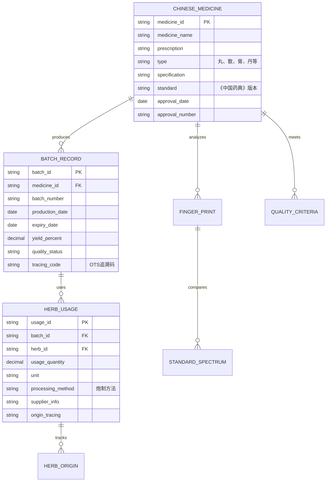
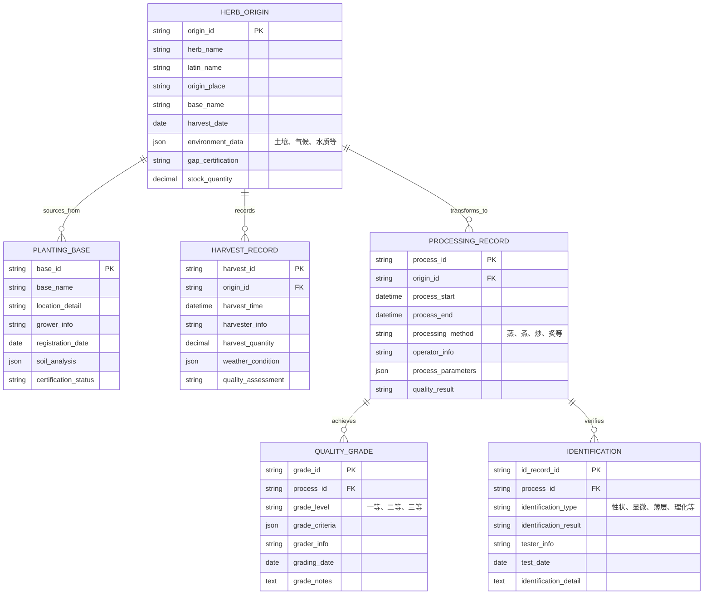
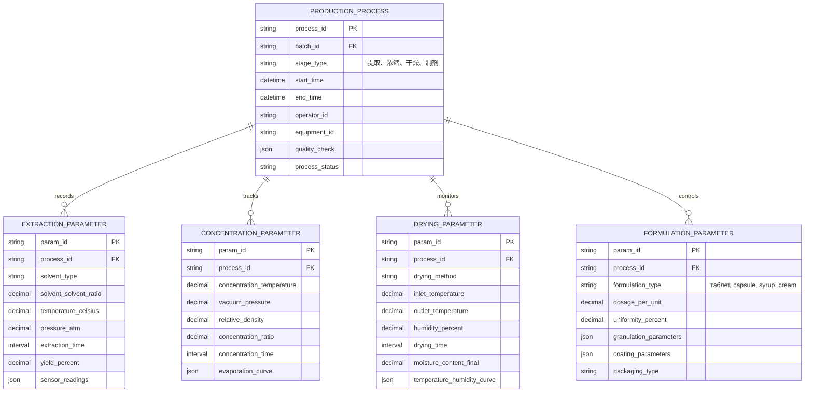
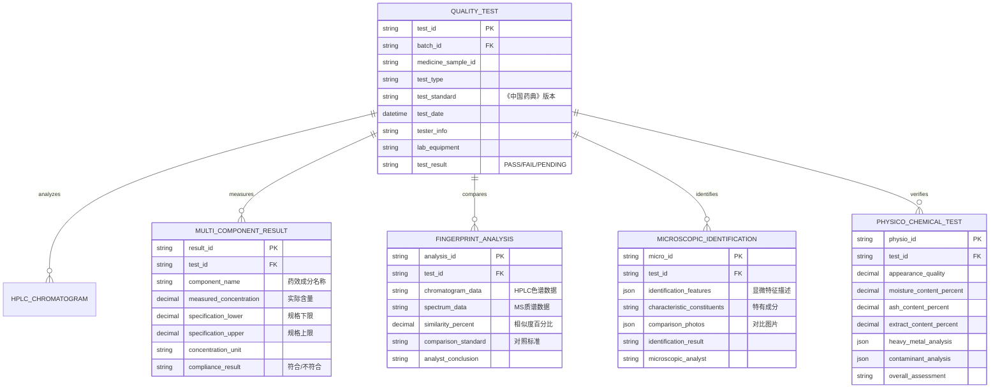
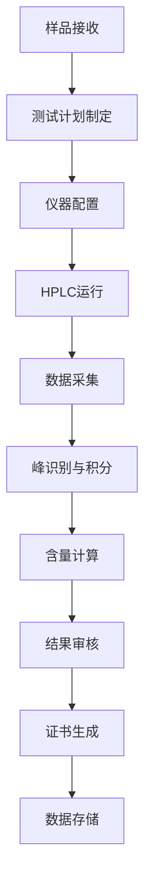
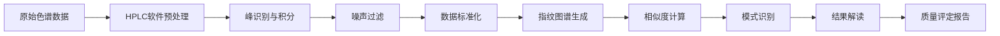
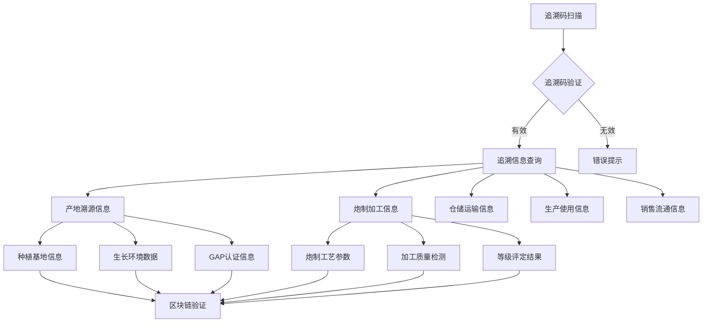

# 中成药信息管理系统架构设计文档

## 目录
1. [中成药特色需求分析](#1-中成药特色需求分析)
2. [中成药系统架构设计](#2-中成药系统架构设计)
3. [中成药数据模型设计](#3-中成药数据模型设计)
4. [中成药微服务设计](#4-中成药微服务设计)
5. [中成药质量控制系统](#5-中成药质量控制系统)
6. [中成药追溯系统设计](#6-中成药追溯系统设计)

---

## 1. 中成药特色需求分析

### 1.1 中成药核心业务特点

中成药（Traditional Chinese Medicine Preparations）不同于西药化学品的突出特点：

| 特性维度 | 中成药特色 | 技术应对策略 |
|----------|-----------|-------------|
| **原料来源** | 多来源、多品种中药材 | 复杂供应链追溯系统 |
| **质量控制** | 基于药典标准、多成分含量 | 指纹图谱分析 + 多成分测定 |
| **生产工艺** | 传统工艺参数非标准化 | 参数化工艺监控系统 |
| **有效性验证** | 临床经验积累 | 数据挖掘 + 智能分析 |
| **溯源要求** | 地道药材 + 炮制工艺 | 全链条追溯体系 |

### 1.2 中成药关键业务场景

#### 1.2.1 中药材供应追溯场景
- **需求**: 中药材从产地到成品全链条追溯
- **挑战**: 涉及温湿度、炮制工艺等多个环节参数
- **解决方案**: OTS(Object Tracking System)中药材追溯系统

#### 1.2.2 制剂工艺质量控制场景
- **需求**: 提取、浓缩、干燥等工艺参数实时监控
- **挑战**: 中成药生产周期长（2-3周），过程复杂
- **解决方案**: 智能化工艺管控系统

#### 1.2.3 产品质量保证场景
- **需求**: 符合《中国药典》质量标准，多成分含量控制
- **挑战**: 指标庞杂（60-100个检测项目）
- **解决方案**: 人工智能辅助的质量管控系统

---

## 2. 中成药系统架构设计

### 2.1 中成药ERP整体架构

```
                               中成药交易平台
                                    │
                    ┌─────────────────────────────────────┐
                    │         中成药ERP整合系统             │
                    │                                     │
                    │ ┌─────────┬─────────┬──────────────┐ │
                    │ │ TCM基础 │ HS供应链│ PT工艺追踪    │ │
                    │ │ 数据服务│ 跟踪服务│ 中间件        │ │
                    │ │ (HTTPS) │ (OTS)   │ (GMP验证)     │ │
                    │ └─────────┴─────────┴──────────────┘ │
                    └─────────────────────────────────────┘
                                          │
                    ┌─────────────────────────────────────┐
                    │         中药材追溯子系统             │
                    │         (国标&企业规范双重合规)      │
                    └─────────────────────────────────────┘
                                          │
                    ┌─────────────────────────────────────┐
                    │         质量保证子系统               │
                    │         (中成药质量管控)             │
                    │                                     │
                    │ ┌─────────┬─────────┬──────────────┐ │
                    │ │ 指纹图谱│ 多成分行 │ 传统鉴别方法│ │
                    │ │ 分析    │ 含量测定 │ 集成        │ │
                    │ │ (OTS)   │ (BMP)    │ (AI辅助)    │ │
                    │ └─────────┴─────────┴──────────────┘ │
                    └─────────────────────────────────────┘
```

### 2.2 中成药系统服务架构

```
前端展示层 (Vue.js + Element Plus)
        │
        ▼
API网关层 (Spring Cloud Gateway)
        │
        ▼
┌──────┬──────┬──────┬──────┬──────┬──────┐
│ QMS  │ MES  │ LIMS │ EDMS │ AUTH │ TCM  │
│ 质量 │ 生产 │ 实验 │ 文档 │ 认证 │ 中医 │─┐
│ 系统 │ 系统 │ 室系 │ 系统 │ 系统 │ 基础 │ │
│ 8081 │ 8082 │ 8083 │ 8084 │ 8085 │ 8086 │ │
└──────┴──────┴──────┴──────┴──────┴──────┘ │
        ▼                                       │
┌──────┬──────┬──────┬──────┬──────┬──────┐ │
│ HS   │ PT   │ QA   │ MSG  │ FILE │ CONF │ │
│ 中药 │ 工艺 │ 质量 │ 消息 │ 文件 │ 配置 │ │
│ 供应链│ 追踪 │ 保证 │ 服务 │ 服务 │ 服务 │ │
│ 8089 │ 8090 │ 8091 │ 8087 │ 8088 │ 8092 │ │
└──────┴──────┴──────┴──────┴──────┴──────┘ │
        ▼                                       │
├──────────────────────────────────────────────┴──┐
│          中成药特色基础设施层                      │
│ OTS追溯库 + 指纹图谱库 + AI推理引擎 + Blockchain │
└───────────────────────────────────────────────────┘
```

### 2.3 中成药专用技术栈

#### 数据存储层
- **PostgreSQL**: 核心业务数据
- **MongoDB**: 指纹图谱大数据存储
- **Redis**: 高性能缓存层
- **MinIO**: 中药材图片/Video存储
- **InfluxDB**: 工艺参数时序数据
- **Blockchain**: 区块链追溯验证

#### 分析处理层
- **Python + 大数据框架**: AI质量推理引擎
- **Spark + HBase**: 指纹图谱大数据分析
- **RabbitMQ + Kafka**: 消息队列适配中药材生产周期
- **Elasticsearch**: 中药材知识图谱搜索

#### 集成接口层
- **OTS标准化接口**: 国家中药材追溯标准
- **EMR集成**: 电子病历质量反馈
- **HIMS集成**: 医院信息管理系统对接

---

## 3. 中成药数据模型设计

### 3.1 中成药核心数据实体



### 3.2 中药材追溯模型



### 3.3 中成药制剂工艺模型



### 3.4 中成药质量控制模型



---

## 4. 中成药微服务设计

### 4.1 TCM中医基础服务 (8086)

#### 核心功能
- 中草药材基础信息管理
- 方剂处方管理
- 中医疗效成分管理
- 药材知识图谱管理

#### API设计
```java
// 获取中草药材信息
GET /api/tcm/herbs/{herbId}
POST /api/tcm/herbs - 创建药材信息

// 查询方剂信息
GET /api/tcm/prescriptions/{prescriptionId}
GET /api/tcm/prescriptions/search?herb= {herbName}

// 中医疗效成分分析
GET /api/tcm/components/analysis/{medicineId}
```

### 4.2 HS中药材供应链服务 (8089)

#### 核心功能
- 中药材供应商管理
- 中药材采购进货管理
- 药材质量等级评定
- 医药材库存管理
- 仓库温湿度监控

#### API设计
```java
// 供应商管理
GET /api/hs/suppliers
POST /api/hs/suppliers
PUT /api/hs/suppliers/{supplierId}

// 采购订单管理
POST /api/hs/purchaseOrders - 创建采购订单
PUT /api/hs/purchaseOrders/{orderId}/status - 更新订单状态

// 库存管理
GET /api/hs/inventory/{herbId}
POST /api/hs/inventory/adjustment - 库存调整
```

### 4.3 PT工艺追踪服务 (8090)

#### 核心功能
- 中药材炮制追踪
- 中成药提取工艺监控
- 浓缩干燥参数记录
- 制剂成型过程控制
- 工艺参数智能预警

#### API设计
```java
// 工艺追踪
POST /api/pt/process/start - 开始工艺过程
PUT /api/pt/process/{processId}/parameter - 更新工艺参数
GET /api/pt/process/{processId}/history - 获取工艺历史

// 实时监控
GET /api/pt/monitor/current/{equipmentId} - 获取设备实时状态
POST /api/pt/monitor/alert - 发送工艺预警

// 过程验证
POST /api/pt/validation/start - 开始过程验证
GET /api/pt/validation/{validationId}/result - 获取验证结果
```

### 4.4 QA质量保证服务 (8091)

#### 核心功能
- 中成药质量标准管理
- 指纹图谱分析集成
- 多成分含量测定管理
- 传统鉴别方法集成
- 质量数据人工智能分析

#### API设计
```java
// 质量标准管理
GET /api/qa/standards/{medicineId} - 获取质量标准
PUT /api/qa/standards/{standardId} - 更新质量标准

// 指纹图谱分析
POST /api/qa/fingerprint/analysis - 执行指纹图谱分析
GET /api/qa/fingerprint/compare/{batchId} - 对比指纹图谱

// 多成分测定
POST /api/qa/multicomponent/measure - 执行多成分测定
GET /api/qa/multicomponent/result/{testId} - 获取测定结果

// AI质量分析
POST /api/qa/ai/predict/{batchId} - AI质量预测
GET /api/qa/ai/insights/{batchId} - 获取质量洞察
```

## 5. 中成药质量控制系统

### 5.1 质量控制架构

```
┌─────────────────────────────────────────────────────────┐
│                    前端展示层                           │
│   GMP合规的操作界面 + 电子签名 + 版本控制              │
└─────────────────────────────────────────────────────────┘
                              │
                              ▼
┌─────────────────────────────────────────────────────────┐
│                业务逻辑处理层                         │
│  • 质量标准管理                            │
│  • 检验计划制定                            │
│  • 结果审核审批                            │
│  • 数据统计分析                            │
└─────────────────────────────────────────────────────────┘
                              │
                              ▼
┌─────────────────────────────────────────────────────────┐
│                数据采集与处理层                       │
│  • HPLC仪器集成                          │
│  • 色谱数据自动采集                        │
│  • 数据预处理和标准化                      │
│  • 智能异常检测                            │
└─────────────────────────────────────────────────────────┘
                              │
                              ▼
┌─────────────────────────────────────────────────────────┐
│                    指纹图谱分析                           │
│  • 大数据量处理                          │
│  • 相似度算法实现                          │
│  • 标准库对比                             │
│  • 结果可视化                              │
└─────────────────────────────────────────────────────────┘
```

### 5.2 多成分含量测定子系统

#### 系统架构


#### 关键技术特点
- **智能装备自动控制**: 进样、洗脱、检测全自控制
- **多组分同时测定**: 1次运行测定10-20个成分
- **参数化分析方法**: 不同药材不同方法自动切换
- **结果自动审核**: 基于历史数据智能比较

### 5.3 指纹图谱质量管控子系统

#### 系统架构


#### 关键技术特点
- **多维信息提取**: UV光谱+MS质谱+多种检测器
- **大数据相似度计算**: 国家药典标准库对比
- **人工智能模式识别**: 自学习质量波动识别
- **可视化结果展示**: 3D指纹图谱+趋势分析

### 5.4 传统鉴别方法数字化子系统

#### 集成鉴别方法
| 鉴别方法 | 数字化解决方案 | GMP验证要求 |
|---------|---------------|------------|
| 性状鉴别 | 图像识别 + NLP描述分析 | 可追溯性验证 |
| 显微鉴别 | 显微图像数字化存储 | 标准对照验证 |
| 薄层色谱鉴别 | TLC扫描仪数字化采集 | 峰值分析验证 |
| 理化鉴别 | 化学计量学算法分析 | 阈值参数验证 |

## 6. 中成药追溯系统设计

### 6.1 OTS中药材追溯标准体系

#### 追溯码体系
```
OTS追溯码结构: [省份代码]+[企业代码]+[年月日]+[批号]+[序列号]

示例: 53+12345678+20241225+BATCH001+0001
= 531234567820241225BATCH0010001
```

#### 追溯信息架构


### 6.2 区块链追溯验证系统

#### 区块链集成框架
```
┌─────────────────────────────────────────────────────┐
│                  追溯数据采集层                     │
│  OTS标签生成 + 生产数据收集 + 质量检测数据记录    │
└─────────────────────────────────────────────────────┘
                        │
                        ▼
┌─────────────────────────────────────────────────────┐
│                  数据验证层                         │
│  哈希算法处理 + 多方签名验证 + 时间戳校验         │
└─────────────────────────────────────────────────────┘
                        │
                        ▼
┌─────────────────────────────────────────────────────┐
│                  区块链存储层                       │
│  智能合约部署 + 区块生成 + 分布式账本同步         │
└─────────────────────────────────────────────────────┘
                        │
                        ▼
┌─────────────────────────────────────────────────────┐
│                  追溯查询层                         │
│  追溯码解析 + 信息验证 + 结果展示                 │
└─────────────────────────────────────────────────────┘
```

### 6.3 移动追溯查询应用

#### 功能特性
- **二维码扫描**: 快速识别追溯码
- **信息展示**: 分层次展示追溯信息
- **真伪鉴别**: AI辅助真伪判断
- **消费记录**: 个人用药数据记录
- **不良反应**: 质量反馈和预警

### 6.4 追溯监管接口

#### 监管数据接口
- **分级监管数据**: 省级、市级监管部门数据划分
- **实时监控数据**: 生产企业质量监控数据
- **质量预警数据**: 质量异常自动预警
- **年度质量报告**: GMP合规性年度报告

## 总结

本中成药系统架构设计充分考虑了中成药行业的特色需求，建立了完整的从药材种植、加工炮制、生产制剂到质量检验的全产业链追溯体系。系统采用微服务架构，确保了高度可扩展性和可维护性，同时通过AI技术和区块链技术提升了质量控制的智能化水平。系统完全符合GMP要求，支持《中国药典》标准，并具备国家药材追溯标准（OTS）的一体化集成能力。

---

*文档版本：v2.0 | 更新日期：2025年11月20日 | 作者：中成药系统架构设计团队*
